# dayGLANCE

**Your day, at a glance.** A privacy-first day planner with visual time-blocking, deep integrations, and zero lock-in. Use it free at [dayglance.app](https://dayglance.app) or self-host it on your own server. Your data stays on your device, and nothing is ever sent to a server unless you choose to sync it yourself.

Part of the **GLANCE family**: focused, standalone apps connected through a shared intent protocol. See also dayGLANCE (today), [lastGLANCE](https://github.com/krelltunez/lastGLANCE) (recent upkeep), and [lifeGLANCE](https://github.com/krelltunez/lifeGLANCE) (your whole timeline).

[](https://play.google.com/store/apps/details?id=com.dayglance.app) [](https://apps.apple.com/app/id6771540599)

[](LICENSE)
[](https://github.com/krelltunez/dayglance/releases)

[**Live App**](https://dayglance.app) · [**Documentation**](https://docs.dayglance.app) · [**Releases**](https://github.com/krelltunez/dayglance/releases)

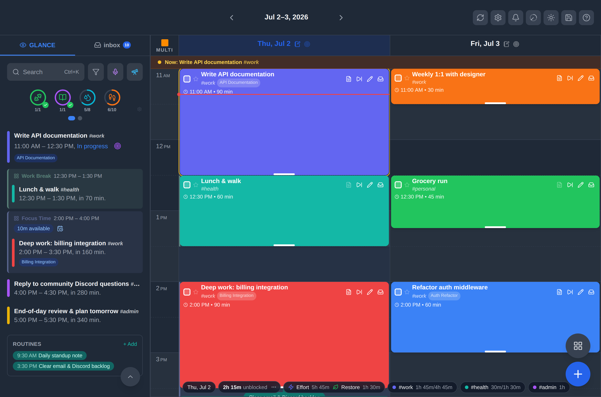

---

## Contents

- [Why dayGLANCE?](#why-dayglance)
- [Quick Start](#quick-start)
  - [Try it now](#try-it-now)
  - [Self-host with Docker](#self-host-with-docker)
  - [Build from Source](#build-from-source)
  - [Desktop App](#desktop-app)
- [Android App](#android-app)
- [iOS & macOS App Store](#ios--macos-app-store)
- [Core Features](#core-features)
  - [The Glance Panel](#the-glance-panel)
  - [GLANCEahead](#glanceahead)
  - [Visual Time-Blocking](#visual-time-blocking)
  - [Frames](#frames)
  - [Desktop Views: MULTI, DAY, WEEK, and MONTH](#desktop-views-multi-day-week-and-month)
  - [Smart Inbox](#smart-inbox)
  - [Focus Mode](#focus-mode)
  - [Day Dial](#day-dial)
  - [Spotlight Search](#spotlight-search)
  - [Notifications & Reminders](#notifications--reminders)
  - [Tags & Filtering](#tags--filtering)
  - [Recycle Bin & Undo/Redo](#recycle-bin--undoredo)
  - [Light & Dark Mode](#light--dark-mode)
  - [Responsive Layout](#responsive-layout)
  - [Progressive Web App](#progressive-web-app)
  - [Weather & Daily Content](#weather--daily-content)
- [Routines & Habits](#routines--habits)
  - [Routines](#routines)
  - [Recurring Tasks](#recurring-tasks)
  - [Habit Tracking](#habit-tracking)
  - [Weekly Review](#weekly-review)
  - [Daily Summary & Statistics](#daily-summary--statistics)
- [Goals & Projects](#goals--projects)
- [Integrations](#integrations)
  - [Nextcloud & WebDAV Sync](#nextcloud--webdav-sync)
  - [CalDAV / iCal Calendar Import](#caldav--ical-calendar-import)
  - [Stream Deck Plugin](#stream-deck-plugin)
  - [TRMNL](#trmnl)
  - [Obsidian](#obsidian)
- [Optional Add-Ons](#optional-add-ons)
  - [AI Assistant (BYO API Key)](#ai-assistant-byo-api-key)
  - [AI Assistants (MCP Server)](#ai-assistants-mcp-server)
  - [Health Connect (Android)](#health-connect-android)
  - [Automation Intents: Tasker (Android)](#automation-intents-tasker-android)
- [Auto-Backup](#auto-backup)
- [Daily Notes](#daily-notes)
- [Keyboard Shortcuts](#keyboard-shortcuts)
- [Tech Stack](#tech-stack)
- [Contributing](#contributing)
- [License](#license)
- [Support](#support)

---

## Why dayGLANCE?

Most day planners make you choose: polished but cloud-dependent, or self-hosted but clunky. dayGLANCE doesn't ask you to compromise.

- **No account required.** Open [dayglance.app](https://dayglance.app) and start planning, and your data lives in your browser.
- **Self-host in one command.** Drop a `docker-compose.yml`, run `docker compose up -d`, and you own everything.
- **Sync your way.** Bring your own Nextcloud, WebDAV server, or Obsidian vault. No proprietary cloud required.
- **Add what you need.** Optional add-ons (AI, health data, Stream Deck, TRMNL display) stay off by default. You opt in.

---

## Quick Start

### Try it now

Go to [dayglance.app](https://dayglance.app), with no sign-up, no install.

### Self-host with Docker

```yaml
services:
  dayglance:
    image: ghcr.io/krelltunez/dayglance:latest
    container_name: dayglance
    restart: unless-stopped
    ports:
      - "6767:80"
```

```bash
docker compose up -d
```

The image is built for `linux/amd64` and `linux/arm64`, so it runs on a Raspberry Pi or other ARM single-board computer as well as on an x86 server. Docker pulls the right one automatically.

The bundled proxy (used for WebDAV and calendar feeds that do not send CORS headers) can reach servers on your own network by design: a NAS on `192.168.x.x`, another container on `10.x`, a Tailscale node, or a service on the same host. It always refuses the cloud metadata endpoint and other reserved ranges, which no sync server uses. If your instance is reachable by people you do not want relaying requests into your network, set `WEBDAV_PROXY_BLOCK_PRIVATE=1` in the container environment to refuse private targets too, matching the hosted deployment. Either way, do not expose the container directly to the public internet without authentication or an access-controlled reverse proxy in front of it.

Available at `http://localhost:6767`. For HTTPS with Caddy:

```caddy
dayglance.yourdomain.com {
    reverse_proxy localhost:6767
}
```

### Build from Source

```bash
git clone https://github.com/krelltunez/dayglance.git
cd dayglance
npm install
npm run dev
```

Open [http://localhost:5173](http://localhost:5173). For production: `npm run build`.

→ See the [full deployment guide](https://docs.dayglance.app/self-hosting) for reverse proxy setup and update instructions.

### Desktop App

Native builds for macOS, Windows and Linux are on the [releases page](https://github.com/krelltunez/dayglance/releases). The desktop app adds what a browser cannot do: the menu bar or tray popup, the Stream Deck listener, native calendar access, and the local MCP server for AI assistants.

| Platform | Artifact | Architectures |
|---|---|---|
| macOS | `.dmg`, `.zip` | Intel (`x64`) and Apple Silicon (`arm64`) |
| Windows | `.exe` installer | x64 |
| Linux | `dayglance_<version>_amd64.deb`, `dayglance_<version>_arm64.deb` | x64 and arm64 |
| Linux | `dayGLANCE-<version>-x64.AppImage`, `dayGLANCE-<version>-arm64.AppImage` | x64 and arm64 |

Every Linux artifact names its architecture. Check yours with `uname -m`: `x86_64` takes the `x64` AppImage or the `amd64` deb, `aarch64` takes either `arm64` file. Debian and AppImage spell 64-bit Intel differently, `amd64` versus `x64`, but they mean the same thing. Running the wrong architecture fails with `cannot execute binary file: exec format error`.

The arm64 AppImage covers 64-bit Raspberry Pi OS and other aarch64 desktops. 32-bit systems reporting `armv7l` are not covered. If you only want the planner itself on an ARM board rather than the desktop features, the Docker image above is lighter.

AppImages need FUSE. If launching complains about it, either install `libfuse2` or run with `--appimage-extract-and-run`.

#### Installing on Linux

**On Debian, Ubuntu, Raspberry Pi OS or anything else with `apt`, take the `.deb`.** It installs properly: the app lands in your applications menu with its icon, and `apt remove dayglance` takes it away again.

```bash
sudo apt install ./dayglance_<version>_arm64.deb
```

Then launch it from your menu, or run `dayglance` from a terminal.

#### The AppImage, if you would rather stay portable

An AppImage is not installed. It is a single self-contained executable that stays wherever you saved it, so there is no setup step and nothing to uninstall later:

```bash
chmod +x dayGLANCE-<version>-arm64.AppImage
./dayGLANCE-<version>-arm64.AppImage
```

It will **not** appear in your applications menu on its own. Two ways to get it there:

**[AppImageLauncher](https://github.com/TheAssassin/AppImageLauncher)**: install it once and every AppImage you open offers to integrate itself, moving the file somewhere sensible and creating the menu entry for you. This is the least work if you use AppImages for anything else.

**A desktop entry by hand**: move the AppImage somewhere permanent, then write one file:

```bash
mkdir -p ~/.local/bin ~/.local/share/applications
mv dayGLANCE-*.AppImage ~/.local/bin/dayglance
chmod +x ~/.local/bin/dayglance

cat > ~/.local/share/applications/dayglance.desktop <<'EOF'
[Desktop Entry]
Type=Application
Name=dayGLANCE
Comment=Your day, at a glance
Exec=/home/YOUR_USER/.local/bin/dayglance
Icon=dayglance
Terminal=false
Categories=Office;Calendar;
StartupWMClass=dayGLANCE
EOF

update-desktop-database ~/.local/share/applications 2>/dev/null || true
```

Replace `YOUR_USER`, since `Exec` does not expand `~`. For the icon, extract it from the AppImage with `./dayglance --appimage-extract` and copy `squashfs-root/dayglance.png` to `~/.local/share/icons/`, or point `Icon=` at any PNG path.

---

## Android App

A native Android app is available on Google Play and as a direct APK download. The Android app distributed through the Google Play Store is a commercial binary that supports continued development.

[](https://play.google.com/store/apps/details?id=com.dayglance.app)

[**Download APK from Releases →**](https://github.com/krelltunez/dayglance/releases)

[**Get it on Obtainium →**](https://github.com/ImranR98/Obtainium)
<br> *Just point Obtainium to `krelltunez/dayGLANCE`!*

The Android app ships the full web app in a WebView with native enhancements that aren't possible in a browser:

| Feature | Details |
|---|---|
| 🏠 **Home screen widget** | Live view of your current time block and upcoming tasks |
| 📅 **Android Calendar** | Read-only access to your device calendar; events appear on the timeline |
| ❤️ **Health Connect** | Pull step counts and activity data from Google Health Connect |
| 🔗 **Obsidian deep links** | Tap `[[wikilinks]]` to open notes directly in the Obsidian Android app |
| 🔔 **Background notifications** | Task and event reminders fire reliably even when the app is closed |
| ⏱️ **Immersive Focus Mode** | Full-screen timer with automatic Do Not Disturb and portrait lock |
| 🎨 **Theme-aware status bar** | Status bar icons match the app's light/dark theme |

| App Timeline (GRID) | App Timeline (LIST) |
|:-:|:-:|
| 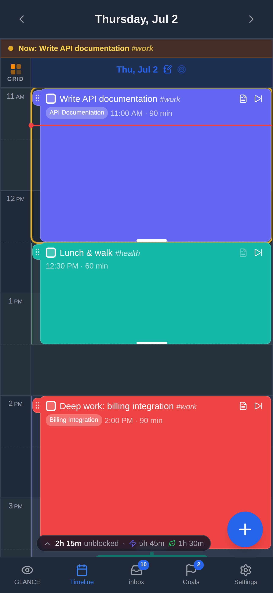 | 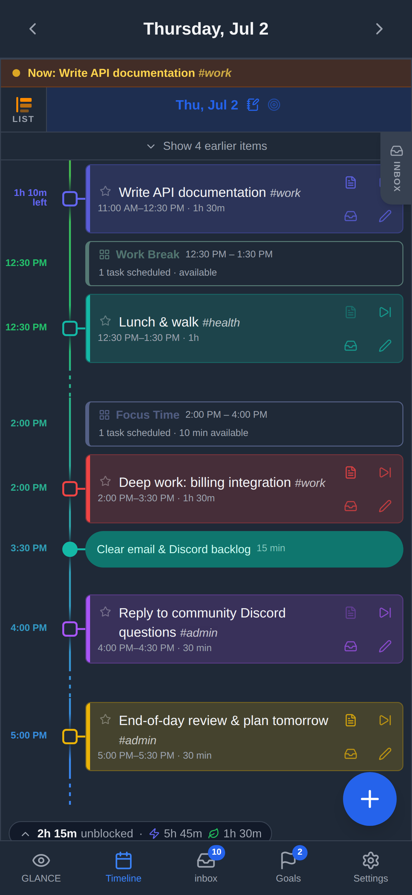 |

---

## iOS & macOS App Store

dayGLANCE is available on the **App Store** for iPhone, iPad, and Mac. Like the Android build, the Apple apps wrap the full dayGLANCE experience with native platform integrations, and a single purchase covers every Apple device you own.

[](https://apps.apple.com/app/id6771540599)

The Apple apps ship the full app natively on each device, with capabilities that only make sense on Apple hardware:

| Feature | Details |
|---|---|
| 🛒 **Universal Purchase** | Buy once and run dayGLANCE on iPhone, iPad, and Mac, with no separate purchase per device |
| ☁️ **iCloud sync** | Tasks, habits, and plans stay up to date between your Mac and iPhone automatically, with no setup |
| 📅 **Native Apple Calendar** | Reads your device calendars directly through EventKit, so every calendar on your iPhone or Mac surfaces color-coded on the timeline (iCal/CalDAV subscriptions work too) |
| 🔗 **Obsidian vault support** | Connect a local Obsidian vault to sync daily notes and tasks directly |
| 📱 **Home Screen widgets** | Glanceable widgets for your day on iPhone and iPad, plus iOS 18 Control Center controls for new tasks and voice input |
| 🔍 **Spotlight search** | Your tasks are indexed in Spotlight, so you can search from anywhere and jump straight into dayGLANCE |
| ⚡ **Quick actions** | Long-press the app icon to create a scheduled or inbox task, start a focus session, or queue voice input |
| 📌 **Menu-bar tray mode (Mac)** | Keep dayGLANCE one click away in the menu bar, with a live focus countdown in the tray |
| 🖥️ **Native on Apple Silicon & Intel** | A true native Mac build that runs on both Apple Silicon and Intel Macs |

---

## Core Features

### The Glance Panel

The heart of dayGLANCE. A real-time snapshot of your day without scrolling through a calendar: color-coded tasks, a live "now" marker showing remaining free time, overdue items, and your daily routines.

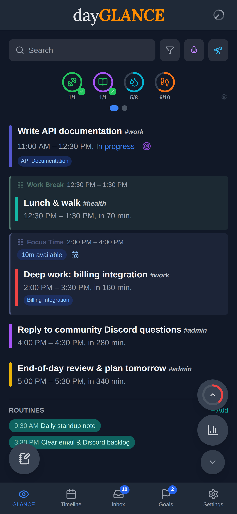

### GLANCEahead

When your day is winding down (either once today's agenda is clear or after 7pm), the Glance panel shifts its focus to tomorrow. GLANCEahead shows the day label, first start time, task and event counts, any deadlines (highlighted in orange), and total committed hours. If tomorrow is empty, it says so. Available across all layouts: mobile, tablet, and desktop.

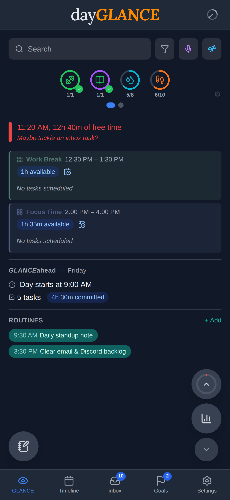

### Visual Time-Blocking

Drag tasks onto a 24-hour timeline, resize by dragging edges, and filter by `#tags`. Supports 1, 2, or 3-day views depending on screen size.


### Frames

Frames are the windows you set aside for a *kind* of work rather than for a
specific task: "deep work, weekday mornings", "admin, Friday afternoon". They
sit behind the timeline as shaded bands, and the day fills in around them.

- **Recurring or one-off.** A frame either repeats on chosen days of the week
  or pins to a single date. Any individual day can be adjusted or skipped
  without touching the pattern.
- **Available time, calculated.** Each frame shows how much of itself is still
  free, after the tasks and routines already inside it and, for today, the time
  that has already passed. A **buffer** (5 minutes by default) keeps a little
  breathing room around each block, so back-to-back scheduling does not creep.
- **Tag affinity.** Give a frame the `#tags` it is meant for and the schedule
  helper offers matching work from your inbox first.
- **Energy level.** Mark a frame low, medium or high energy, so a demanding
  window does not get filled with whatever happened to be next.

Drop a task into a frame from the timeline, or open the frame and pick from the
filtered inbox. With the AI add-on enabled (**Settings → AI**), **Frame nudge**
suggests a specific task while a frame is running, and **Smart Schedule** offers
to fill your frames from the inbox in one pass.

**Setup:** The grid button floating over the timeline opens Frames, where you
create and edit them. On phones and tablets it is the same button, above the
add-task button.

### Desktop Views: MULTI, DAY, WEEK, and MONTH

On wide screens a view cycler appears in the timeline header, letting you switch how the day is laid out:

- **MULTI**: adjacent days side by side (up to three at once), the default multi-day timeline.
- **DAY**: a single day, with the full 24 hours wrapped across columns so nothing is off-screen.
- **WEEK**: a seven-day grid for planning the week at a glance.
- **MONTH**: the whole month, each day a small timeline of its blocks. Tap a day to open its agenda in a sheet and swipe or use the arrow keys to move between days. On phones it is the third mode of the view toggle, between LIST and SCHED.

Views you do not use on a given device can be turned off under Settings, "Views on this device": they leave the switcher, the number keys and the default-view picker there, and nothing else changes. At least one view stays on.

| MULTI | DAY |
|:-:|:-:|
| 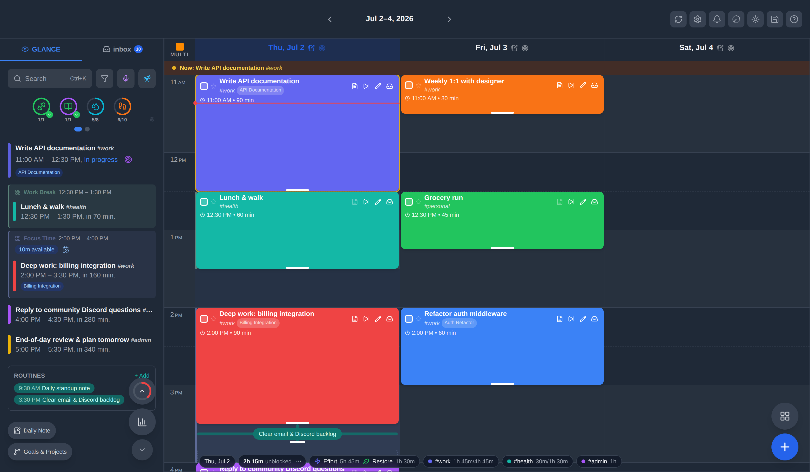 | 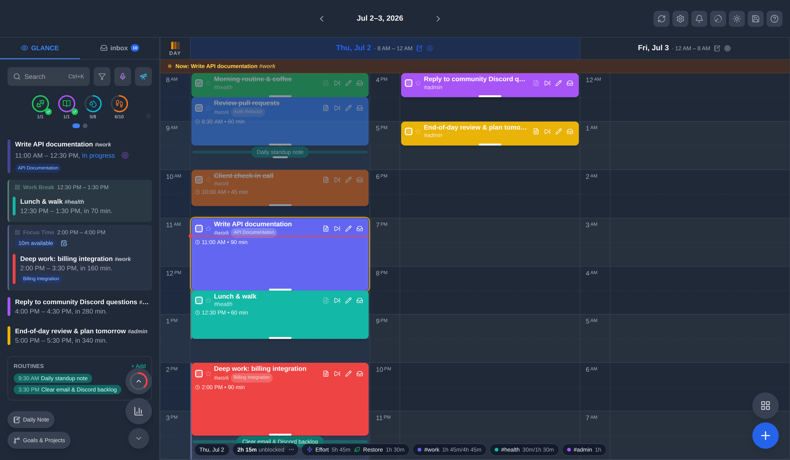 |

| WEEK | MONTH |
|:-:|:-:|
| 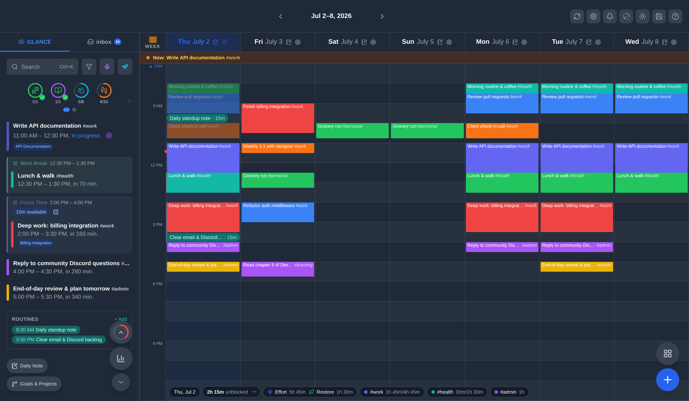 | 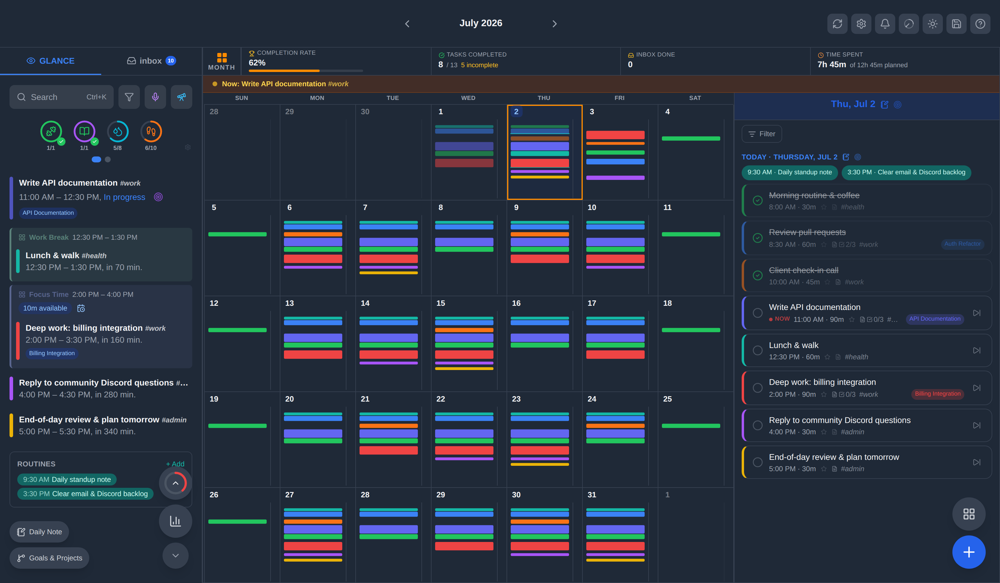 |

### Smart Inbox

Capture tasks without scheduling them. Three priority levels, tag filtering, and drag-to-timeline when you're ready to commit.

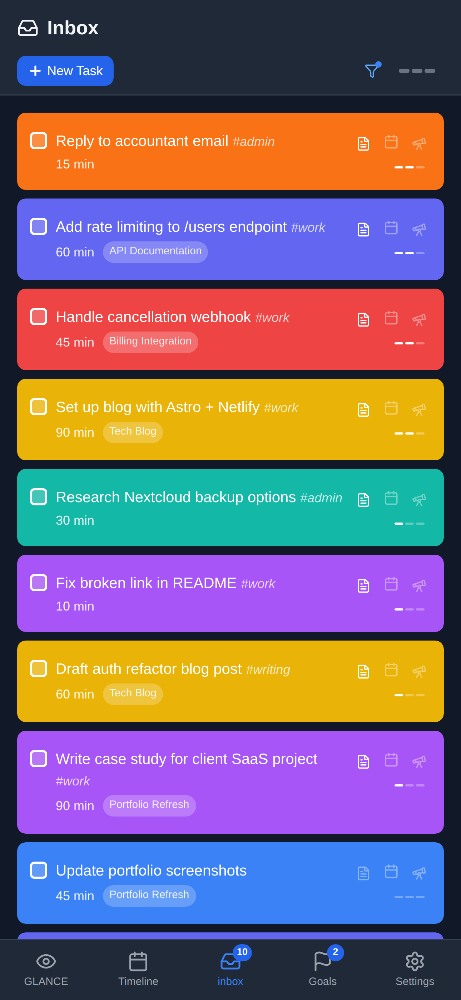

### Focus Mode

A Pomodoro-style timer with customizable work, short break, and long break durations. Attach a timer session to a specific task and mark it complete when done. On mobile, goes fully immersive with Do Not Disturb and portrait lock.

**Focus Mode only offers itself when there is something to focus on.** It becomes available when a task is *in progress right now*, and when that stretch of the timeline still has **45 minutes or more left to run**. Consecutive blocks count as one stretch: three back-to-back half-hour tasks are ninety minutes of focus, not three sessions too short to start. An all-day item or an already-completed task never counts.

When it is available:

- A pulsing target icon appears beside the current task in the GLANCE panel. Click it to start.
- Press **`F`** from anywhere in the app.
- Open it from the Day Dial when viewing today.
- Trigger it from the Stream Deck plugin or an automation intent (`startFocus`).

If nothing is running, or the current stretch has less than 45 minutes left, the icon is absent and `F` does nothing. That is the intended behaviour rather than a fault: the timer is for a block worth protecting, not for the last ten minutes of one.

| Setup | Active Session |
|:-:|:-:|
| 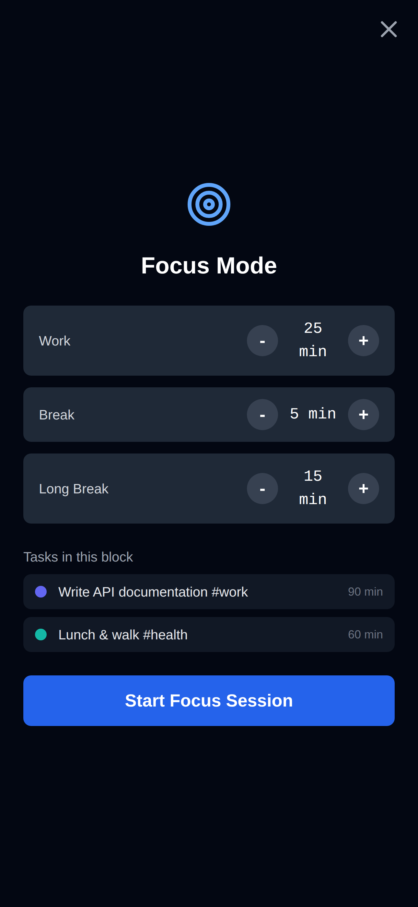 | 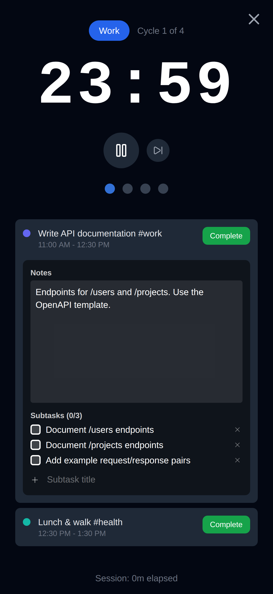 |

### Day Dial

An ambient, fullscreen view of the day as a 24-hour instrument dial: midnight at top, your schedule as a glowing ring, the current time as a single orange sweep line. Designed to be read from across the room: press `O` (or the dial button in the desktop header) to open it, `Esc` to close, `←`/`→` to page through days, `T` to jump back to today, and `F` for full screen. On mobile, tap the dial button at the top of the GLANCE tab and swipe sideways to page through days.


Overlapping blocks (a session nested inside an all-day conference, or a genuine double-booking) split onto concentric lanes instead of painting over each other, with the more specific block taking the outer edge. Lanes are scoped to each pile-up, so a clean afternoon keeps its wedges at the ring's full depth.

A block that runs past midnight is drawn flush to the boundary instead of stopping short at it, and reappears on the next day's dial for as long as it actually runs; both days name its true hours, with a `+1` or `−1` marker for the date the other end lands on. Blocks you have completed settle into a quiet filled shape with their rim all but gone, while one that has passed and was never ticked keeps its rim at full strength over a hollowed fill, so what is still owed stays legible in the spent part of the ring.

If routines are enabled, today's scheduled routines ride their own track inside the tick ring as quiet teal bars, each as long as the routine is scheduled for. They stay unlabelled at rest: hover one, or select it with the keyboard, and its name appears in a chip beside it; the routine running right now names itself with no input at all, so a wall panel always has something to read. Completed ones fade back, the legend counts them (`2/6`), and the Layers panel can turn the track off. Routines only exist for today, so no other date draws them.

All-day items (a holiday, a birthday, anything without an hour) never go on the ring, since nothing timeless belongs on a time axis. They sit in their own pill at the bottom, in the same grammar as the day's totals: the two meet on the dial's vertical axis, the line under the 12, and grow outward from it, so a landscape display spends none of its scarce height on them. Only a band too narrow for both, such as a phone, stacks them, and there they stretch to the dial's own width with the items spilling onto a second row. Each one opens the same actions as a scheduled block, and the pill collapses to a quiet "+N" when the day carries more than fit.

Everything on the ring is reachable from the keyboard, with no tabbing to get there: press `↑` or `↓` anywhere in the dial and the block running now lights up and reads out in the hub, then those keys walk the day's blocks (`Home`/`End` for the first and last), `Enter` opens that block's actions (mark complete, open in planner), and `Esc` steps back out. Screen readers get the ring as a labelled list, each block announcing its title, time range, duration, and how long until it starts or ends.

If a weather location is set, hairlines mark sunrise and sunset (both amber, each with a sun rising or setting over a horizon), computed locally from your coordinates, so they work for any date and offline. Between them the lit part of the day is drawn as a soft band, brightest at solar noon and fading back into the hairlines at each horizon. Its length and its brightness both come from the sun's real elevation, measured against the best noon your latitude ever gets, so a December day reads as short *and* low rather than being flattered into looking like June. Where the forecast reaches, the UV index scales it, which is the one part that knows about the sky rather than the geometry: haze, cloud and thin mountain air all show up there. Above the Arctic and Antarctic circles it does the honest thing at both extremes: lit right around the ring under the midnight sun, and absent through the polar night.

After dark the same track carries the moon. It is drawn only for the hours the moon is genuinely above the horizon and the sun is not, at a brightness set by how high it rides and how much of its disc is lit, so a full moon gives the night a soft silver arc and a new moon gives it nothing. One local day often holds two separate stretches, because the moon routinely sets before dawn and is back before the next midnight. A glyph at the moon's apex — the minute it rides highest that night — shows the actual phase, waxing or waning, mirrored below the equator. Like the sun, all of it is computed from your coordinates, for any date and offline. On days the forecast covers, hour temperatures appear at the 3-hour marks and rain or snow spells are traced as a thin arc along the ring's inner edge. The Layers button in the corner toggles the sun and moon, the weather ring, focus sessions, and imported calendar events; choices persist per device.

Up to four complications ride the corners of the face. Inbox, Deadlines and Done are always on offer; with goals and projects enabled you also get **Aligned**, which is Done's sibling on the same denominator and a different axis. Done asks how much of today you finished, Aligned asks how much of it went to work that is filed under a project. Its sheet shows where the aligned time went, and lists the unfiled blocks so one tap opens the editor that can file them. A **project** can ride the face too, showing how far along it is, with its open tasks in the sheet wherever they are scheduled. The Layers panel configures them a corner at a time: four dropdowns, one per corner, each offering Empty and every available readout, with habits and projects grouped inside. Choosing a readout that is already in another corner swaps the two rather than leaving a copy behind, so moving one across the face is a single choice. Because the corner is the setting rather than something derived, a readout that means nothing on the date you are viewing leaves its corner empty instead of shuffling the others along, and everything stays put as you page through days.

**Complications** put up to four readouts in the corners of the face, watch-style, chosen in the Layers panel: your Inbox count (matching the sidebar's own filtered count exactly), the day's deadline count, how much of the day's planned work is **done**, and any habit, shown as its own ring and icon with no label. Tapping one opens it: the counts list what's in them, and each row carries two actions: a circle ticks the task off without leaving the dial, and the rest of the row hands it to the normal editor, so a deadline can still be given a time without a detour through the planner first. A habit works the way it does in GLANCE: a tap adds one (the point of the whole thing: one more glass of water without leaving the dial), a press-and-hold opens the counter for a correction. The counts are drawn as recessed subdials and the habit rings sit deliberately desaturated, so nothing on the face out-shines the now-line. The Done ring is weighed by minutes rather than by block count, so a two-hour block counts for more than a fifteen-minute errand, and it turns green only once everything scheduled is finished; tapping it lists what's left, and ticking a row there moves the ring you just tapped. It is a corner subdial rather than an arc on the ring for a reason: angle means time of day everywhere else on this face, so a sweep encoding a fraction would read as a span of hours. Readouts that are only about today, such as the inbox and a habit's tally, hide when you page to another date, while the ones that are facts about the day on screen stay. They appear only where the face is big enough to carry them, in one of three sizes chosen from the dial's measured diameter, so a phone dial stays uncluttered and a wall display doesn't get specks.

**Focus sessions** are drawn as a pale rail inside the blocks they happened in. Focus mode can only run inside a block that is already on the ring, so the rail answers the one question the wedges cannot: not what you planned, but which part of it you actually sat down for. Back-to-back sessions inside one block read as a single stretch, and the day's total gets its own figure in the summary strip, kept out of the Effort and Restore totals, since those same minutes are already counted there. Tapping the block that is running now also offers to start a session, so the dial is a way in as well as a record. Sessions logged before this existed kept their totals but not their times, so the ring is honestly bare for those days.

For a wall display or kiosk, append `?dial` to the URL to boot straight into it, for example `http://localhost:6767/?dial` on a self-hosted Docker instance, or a pinned PWA on a wall tablet. The dial is built to run unattended: it follows the date across midnight, the cursor and corner buttons fade after a few seconds of stillness, and a browsed date snaps back to today after five idle minutes.

**Ambient mode** turns the dial into a screensaver: press `A` (or the eclipse button) to go fullscreen with the screen wake lock held and all controls hidden. Tap, click, or press any key to exit; a drifting cursor won't. While ambient, the whole face drifts through a slow pixel orbit to guard OLED panels against burn-in. Boot a kiosk straight into it with `?dial&ambient`, or enable auto-start in the Layers panel (`L`) with a configurable idle delay, including "Also start from planner", the true screensaver: after the idle delay anywhere in the app, the dial takes over, and waking returns you exactly where you were.

### Spotlight Search

`Ctrl+K` / `Cmd+K` searches across all tasks (scheduled, inbox, recurring, and deleted), matching titles, tags, task notes, and subtasks, plus the text of your daily notes, with highlighted matches. Daily notes are left out of the search when the Obsidian integration is enabled — use Obsidian's own search for what lives in your vault.

### Notifications & Reminders

Configurable reminders for tasks and calendar events: 5, 10, or 15 minutes before, at start, or at end. In-app toasts and native browser (or Android background) notifications.

### Tags & Filtering

Add `#tags` to any task. Filter the timeline and inbox by one or more tags, with autocomplete as you type.

### Recycle Bin & Undo/Redo

Deleted tasks go to a recycle bin. Full undo/redo stack (`Ctrl/Cmd+Z` / `Ctrl/Cmd+Shift+Z` or `Ctrl/Cmd+Y`) for all actions.

### Light & Dark Mode

Light and dark themes across every component, including custom scrollbars and mobile status bar.

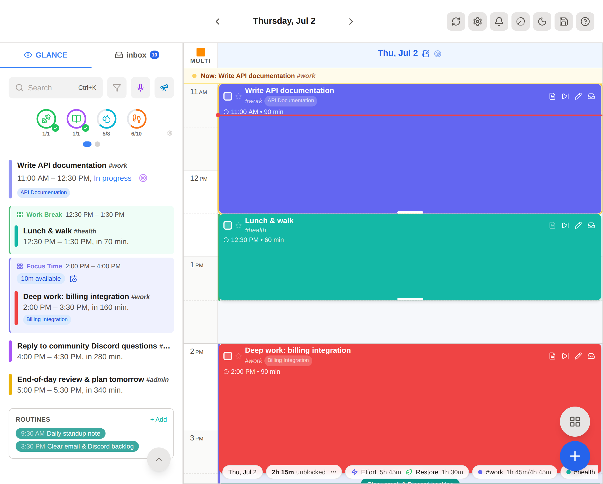

### Responsive Layout

dayGLANCE adapts per device:

| 3-Column (Wide Desktop) | 2-Column (Medium) | 1-Column (Narrow) |
|:-:|:-:|:-:|
| 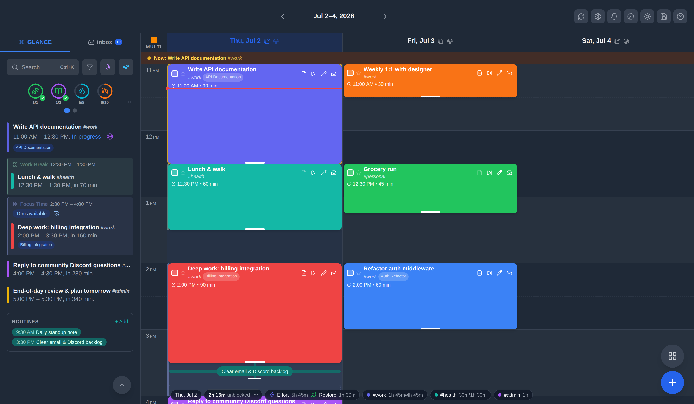 | 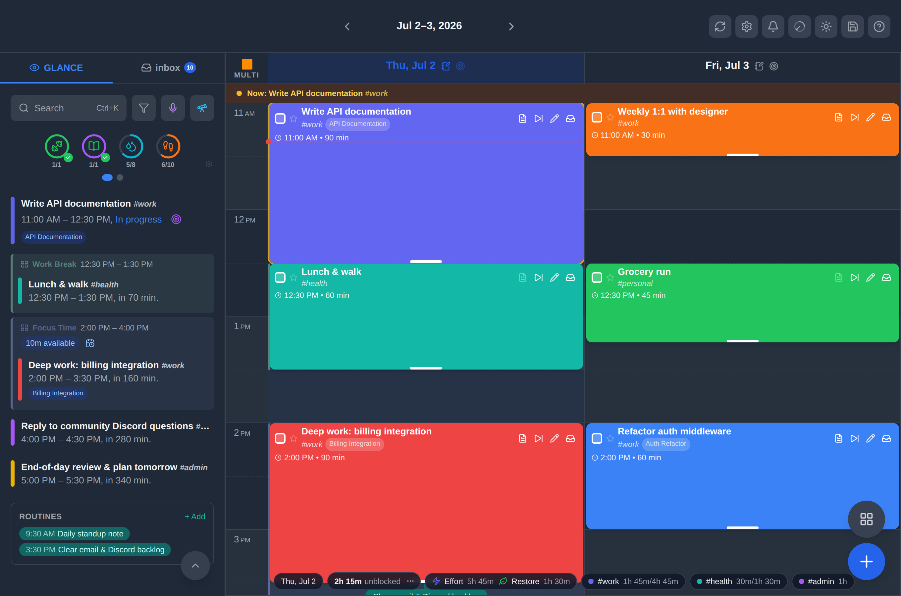 | 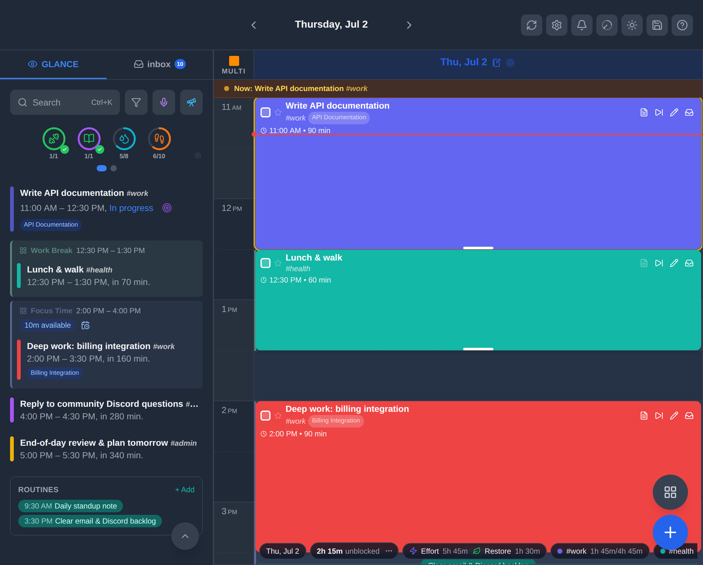 |

- **Desktop**: Multi-day timeline, sidebar with inbox and stats, mouse drag-and-drop, task resizing
- **Tablet**: Tabbed side panel (Glance | Inbox), floating action buttons, touch-optimized spacing
- **Phone**: Tab-based navigation, swipe gestures to schedule tasks, long-press drag, bottom sheet modals

### Progressive Web App

Install on any device for a native-like experience. Core planning features work fully offline after the first load; integrations (weather, calendar sync, cloud sync, AI) require an active connection. Auto-updates when a new version is deployed.

### Weather & Daily Content

Current weather and a 5-day forecast in the header (by zip code). A rotating panel shows dad jokes, fun facts, quotes, and "this day in history."

---

## Routines & Habits

### Routines

Build reusable daily task templates for each day of the week. Drag a routine onto the timeline in one gesture to populate your day instantly, with no re-entering recurring tasks.

### Recurring Tasks

Set tasks to repeat daily, weekly on specific days, monthly, or on custom intervals. Edit a single occurrence or the entire series.

### Habit Tracking

Track streaks and daily habit completion alongside your schedule. The agenda view shows habit rings for the current day, and tapping habit rings on past days gives you a popup breakdown of that day.

### Weekly Review

A guided end-of-week flow: weekly stats, reflection prompts, and planning ahead. Set a configurable reminder so you never skip it.

### Daily Summary & Statistics

Tasks completed, completion rate, time planned vs. spent, focus time logged, and lifetime trends with averages and streaks.

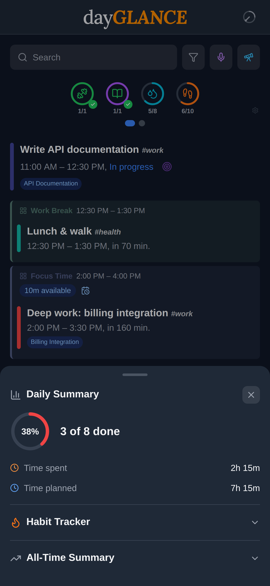

---

## Goals & Projects

Organize long-horizon work into a hierarchy of **Goals → Projects → Tasks**, with optional **Areas** to group related goals.

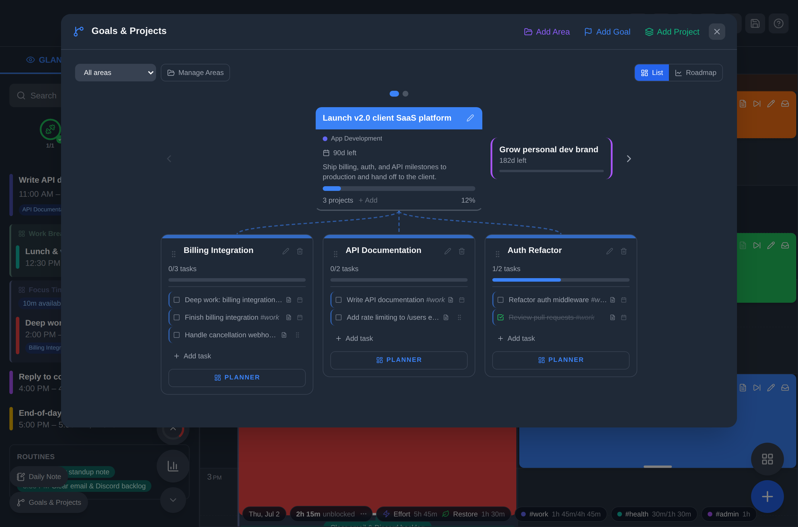

**Goals** are high-level objectives with an optional target date and color label. Each goal displays a progress bar and hosts a flowchart of its child projects, connected by visual lines. A one-click completion button appears once all child projects are done.

**Projects** sit beneath a goal (or standalone) and group related tasks. Each project card shows task count, a duration-weighted progress bar, and an inline quick-add form. Tasks can be checked off, reordered by drag, or promoted to the full task editor.

**Standalone Projects** are available for work that doesn't belong to a broader goal; they appear in a separate section below the goal carousel.

**Project Focus**: when a project has tasks scheduled for today, a Focus button appears on its card. Activating it filters the timeline down to just that project's tasks for a distraction-free work session.

**hyperGLANCE** turns a project into a standing appointment with itself. Give a project a hyperGLANCE session and it gets a schedule (recurring weekdays or a one-off date), a start time, a duration, its own icon and colour, and a list of **template tasks** that are instantiated fresh at the start of every session.

Scheduled sessions appear on the timeline, in the week and month views, and in the GLANCE panel's up-next, so a standing commitment to a project is visible the same way a meeting is. Starting one opens a fullscreen workspace: a Pomodoro timer, the session's task list, and the project's notes and subtasks in a side panel, with the linked Obsidian note in reach if the vault is connected. On Android it takes Do Not Disturb with it. Finishing a session records it against the project, so the cadence itself becomes something you can see.

It is the difference between "this project exists" and "this project happens on Tuesday at 9". Projects that only ever get worked on when there is a gap tend to be the ones that stall.

Progress is duration-weighted: a 2-hour task moves the needle more than a 15-minute one. Goals without target dates never show as overdue; goals and projects past their target date surface an amber warning. Projects inactive for 7+ days with incomplete tasks are flagged as **Stalled**.

Archived goals and projects collapse into a disclosure section at the bottom and are excluded from all progress calculations.

**Areas** are an optional top level that group related goals (for example work vs. personal). Filter the dashboard to a single area, or view every goal together.

**Roadmap view** trades the card dashboard for a horizontal timeline: each goal becomes a bar spanning today to its target date, with an adjustable range from one month to two years, so you can see where everything lands.

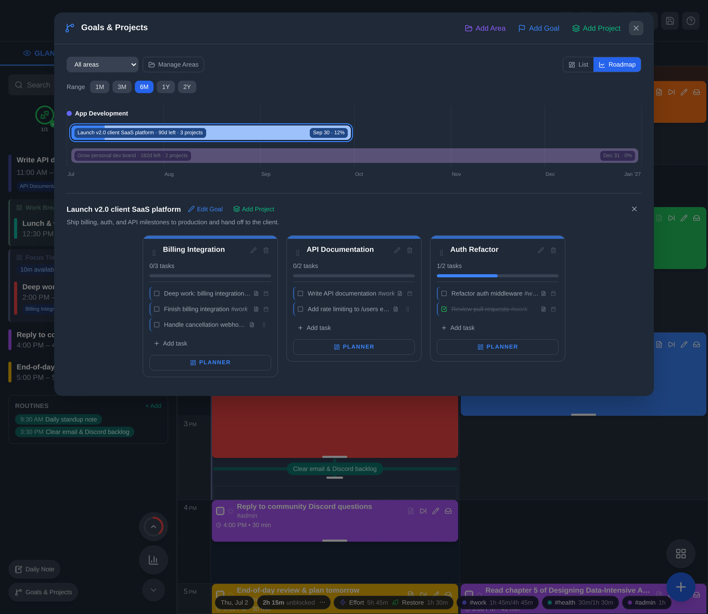

**Setup:** Disabled by default; enable in **Settings → Goals & Projects**. Data syncs alongside tasks via WebDAV/Nextcloud.

---

## Integrations

### Nextcloud & WebDAV Sync

Sync your entire planner across devices via WebDAV. Compatible with **Nextcloud**, Hetzner Storage Box, Synology, Seafile, Radicale, and any generic WebDAV server.

The sync engine resolves conflicts at the task level using timestamps, not last-write-wins, so simultaneous edits from two devices merge cleanly.

**Setup:** Settings → Cloud Sync → choose Nextcloud or Generic WebDAV → enter URL and credentials. Syncs automatically every 15 minutes or on demand.

**End-to-end encryption** is available as an opt-in. When enabled, all sync data is encrypted with AES-256-GCM before leaving your device, and your passphrase never leaves your device and the server never sees plaintext. On Android, the derived key is stored in the hardware-backed Android Keystore; on iOS it is kept in the device Keychain, along with the GLANCEvault connection, so it survives a WebKit storage purge. Enable in **Settings → Cloud Sync → Enable end-to-end encryption**.

One address policy backs all of this, and it is implemented separately in the desktop app, the four server-side proxies, and the sibling GLANCE apps. `api/ssrf-vectors.json` is the canonical table those implementations are checked against; regenerate it with `npm run ssrf:vectors` after any policy change and copy it to the siblings, the same way `dayDial.vectors.json` keeps the dial geometry in agreement across platforms.

**Reaching a server on your own network (desktop app).** The desktop app routes sync through the Electron main process, which refuses private network addresses by default so that a hostile URL cannot be used to probe your LAN. A self-hosted GLANCEvault usually *is* on a private address, though, whether that is a LAN box on `192.168.x.x`, a Docker host on `10.x.x.x`, or a Tailscale node (Tailscale hands out addresses in `100.64.0.0/10` and `fd7a:115c:a1e0::/48`, both of which count as private even when you point a public domain name at them). Run **Settings → Cloud Sync → Test Connection**: if the address is blocked, the app offers **Allow this address…** and asks you to confirm in a native dialog. The permission covers that one scheme, host and port, never a whole range, and it never applies to a redirect. Granted addresses are listed under the vault fields and can be removed there at any time. A vault on the same machine as the app (`localhost`, `127.0.0.1`) works the same way, and is permitted only for the exact port you confirm, so allowing the vault on one port grants nothing to anything else listening locally. Link-local addresses, which include the cloud metadata endpoint, cannot be permitted at all. The browser and mobile apps connect directly and are unaffected.

### CalDAV / iCal Calendar Import

Import events from any iCal-compatible source: Google Calendar, Nextcloud Calendar, Apple Calendar, Fastmail, Proton Calendar, etc. Events appear color-coded on your timeline and refresh every 15 minutes.

**Setup:** Settings → Calendar Sync → paste your calendar URL.

### Stream Deck Plugin

The plugin extends dayGLANCE to your Stream Deck, connecting locally to the desktop app over WebSocket and staying in two-way sync, so anything you do on the Stream Deck reflects in the app and vice versa. Requires the desktop app to be installed on the same system as the Stream Deck software.

**Setup:** See [Elgato Marketplace](https://marketplace.elgato.com/product/dayglance-22e1e573-0a61-4b0b-9112-e09500917d8e) for more details.

### TRMNL

Display your current time block and upcoming tasks on your **TRMNL** e-ink display. dayGLANCE provides a TRMNL-compatible plugin endpoint so your display always reflects what's next.

**Setup:** See the [TRMNL integration guide](https://docs.dayglance.app/trmnl) in the documentation.

### Obsidian

Sync tasks and daily notes directly with your **Obsidian vault**, with no plugin required. dayGLANCE reads and writes your vault's markdown files directly via the browser's File System Access API (desktop) or Android's native file bridge.

- Tasks with `[[wikilinks]]` are recognized and displayed across all platforms
- On desktop, tap the link icon to expand the linked note inline on the timeline
- On Android, tap the link icon to open the note directly in the Obsidian app
- Supports all Obsidian task formats, duration ranges (`HH:MM-HH:MM`), moves, rescheduling, and title edits
- Daily notes sync **bidirectionally**

**Setup:** Settings → Obsidian → select your vault folder. Available in the desktop app on macOS, Windows and Linux, in desktop browsers (Chrome, Edge, Brave), and in the Android app.

#### Bridge plugin (optional)

Folder sync above needs no plugin and never will. The **dayGLANCE Bridge** plugin is for the things a folder cannot do: it runs *inside* Obsidian, so it can work while dayGLANCE is closed and can put dayGLANCE's data in Obsidian's own UI.

- **An agenda in the sidebar.** A mini month calendar over the selected day's scheduled tasks, recurring instances and imported calendar events, with the day's routines as a pill strip underneath. Tags render faded and `[[wikilinks]]` click through. Tick a task's box and a running dayGLANCE applies the completion, so its log, vault writeback and sync all fire properly rather than the box being flipped behind its back.
- **Task sources beyond daily notes.** Point the plugin at folders or tags and the open tasks in those notes become dayGLANCE tasks, with completions tracked for a window you choose.
- **Project and goal notes.** Link a note to a dayGLANCE project or goal. The link lives in a `dayglance-id` frontmatter key, so it survives renames and moves, and a `dayglance:` frontmatter map keeps status in sync for Dataview queries.
- **No double writes.** One copy of a vault applies changes at a time, via a short lease, so a second desktop running the same vault through Obsidian Sync receives the result instead of racing to write it.

Pairing is a code shown in dayGLANCE and entered in the plugin's settings tab. The agenda additionally needs your dayGLANCE sync passphrase entered once per device; the derived key is kept in that device's local storage and never written to the plugin's synced settings.

**Setup:** The plugin is **unlisted** rather than in Obsidian's community directory: install it manually or through BRAT from [`dayglance-obsidian-plugin/`](dayglance-obsidian-plugin/). Then pair from **Settings → Obsidian → Bridge plugin**.

---

## Optional Add-Ons

These features are **off by default**. Enable what you want; nothing runs in the background until you opt in.

### AI Assistant (BYO API Key)

Bring your own OpenAI-compatible API key (OpenAI, Ollama, OpenRouter, etc.). No key is ever stored on our servers.

Once enabled in **Settings → AI**:

| Feature | What it does |
|---|---|
| 🎙️ **Voice assistant** | Create or edit tasks via natural language |
| 💡 **Frame nudge** | Suggests a specific task when a time block is active |
| ⏱️ **Duration & tag estimates** | Pre-fills likely duration and tags on task creation |
| ✅ **Subtask generation** | Generates a subtask list from any task's notes panel |
| 🔄 **End-of-day rescheduling** | Reviews incomplete tasks and suggests times to move them |
| 🌙 **Evening reflection** | Guided end-of-day prompt to capture wins and plan tomorrow |

### AI Assistants (MCP Server)

Let an AI assistant on the same computer read your day and manage your tasks. dayGLANCE's desktop app includes a local **MCP (Model Context Protocol)** server, so clients like Claude Desktop, Claude Code, and ChatGPT can ask what's scheduled, find the free time in your day, add and reschedule tasks, and check goal progress.

- **Local only.** The listener binds to `127.0.0.1` and is never reachable from the network. Nothing is sent anywhere by dayGLANCE.
- **Three separate opt-ins.** Reading dayGLANCE data, writing changes, and reading your device calendar are each their own consent
- **12 tools and 3 read-only resources** covering the schedule, inbox, goals, projects, today's routines, and your frames: the windows you set aside for a kind of work, each reported with the time still free inside it and the tags it is meant for
- **Every change is undoable.** Writes land in a session journal you can reverse per task or in bulk, from the app or the macOS tray. A kill switch stops the server outright
- **Routines and frames are visible but untouchable.** An assistant can see them so it schedules around them, never through them: a write that would land on a routine is refused outright rather than quietly moved to the next free slot
- Device calendar events are always read-only, and writes to them are refused

**The tradeoff to understand:** an assistant that reads your data typically sends what it reads to its own AI provider over the internet. dayGLANCE cannot see or control what a client does with data it has read, and this sits outside dayGLANCE's own privacy guarantees. Review the privacy policy of any client you connect.

**Setup:** Settings → Local Integrations. Claude Code connects directly over HTTP. Claude Desktop and ChatGPT connect through [`@glance-apps/mcp-bridge`](https://github.com/glance-apps/mcp-bridge), and direct-download builds on macOS and Windows can configure Claude Desktop for you with one click. Other clients, including ChatGPT, add the bridge through their own MCP settings. Full tool reference in [docs/mcp-tools-reference.md](docs/mcp-tools-reference.md).

### Health Connect (Android)

Pull step counts and activity data from **Google Health Connect** into your daily summary. Visualize your movement alongside your schedule.

**Setup:** On first use, dayGLANCE will prompt you to grant Health Connect permissions via Android's standard permissions dialog. To manage or revoke permissions later, go to the **Android Health Connect app → App permissions → dayGLANCE**.

### Automation Intents: Tasker (Android)

Automate dayGLANCE from **Tasker**, MacroDroid, Automate, or any Android app that can send broadcasts. Four inbound actions (`CREATE`, `COMPLETE`, `OPEN`, and `QUERY`) each take a JSON `payload` extra, so a Tasker profile can add a task, complete one by title, jump to a tab, or read your current task counts. Every action replies with an `app.dayglance.RESULT` broadcast, and dayGLANCE emits `app.dayglance.NOTIFY` broadcasts whenever tasks change state (completed, rescheduled, updated, deleted), so your automations can react to what happens in the planner too.

**Setup:** Off by default. Enable in **Settings → GLANCE Integrations → "Automation intents (Tasker)"** (on phones, the "Automation intents" section). Full action and payload reference, with Tasker profile examples, in [docs/tasker-integration.md](docs/tasker-integration.md).

---

## Auto-Backup

Automatic local and remote backups with configurable frequency (hourly, daily, weekly) and retention policies. Remote backups go to your WebDAV server and are encrypted if end-to-end encryption is enabled. Restore from any backup with one click.

---

## Daily Notes

Attach freeform notes to any day for journaling, reflections, or quick references. Notes sync across devices via WebDAV alongside your tasks, and bidirectionally with Obsidian daily notes.

---

## Keyboard Shortcuts

| Shortcut | Action |
|----------|--------|
| `Ctrl/Cmd + K` | Spotlight search |
| `N` | New scheduled task |
| `I` | New inbox task |
| `G` | Open Goals & Projects |
| `R` | Open routines dashboard |
| `F` | Focus mode |
| `T` | Jump to today |
| `M` | Toggle month nav |
| `Space` / `Shift+Space` | In MONTH: next / previous day |
| `↑` / `↓` | In MONTH: a week back / forward |
| `Enter` | In MONTH: open the selected day |
| `D` | Toggle dark mode |
| `/` | Toggle tag filter |
| `Ctrl/Cmd + Z` | Undo |
| `Ctrl/Cmd + Shift + Z` / `Ctrl/Cmd + Y` | Redo |
| `Escape` | Close modal / dropdown |
| `?` | Show full shortcut list |

---

## Tech Stack

| Layer | Technology |
|-------|-----------|
| UI Framework | [React 18](https://react.dev) |
| Build Tool | [Vite 5](https://vitejs.dev) |
| Styling | [Tailwind CSS 3](https://tailwindcss.com) |
| Icons | [Lucide React](https://lucide.dev) |
| PWA | [vite-plugin-pwa](https://vite-pwa-org.netlify.app) + Workbox |
| Testing | [Vitest](https://vitest.dev) |
| Containerization | Docker + Nginx |

---

## Contributing

dayGLANCE is MIT-licensed and actively maintained. Contributions are welcome, from bug fixes to new integrations.

See [CONTRIBUTING.md](CONTRIBUTING.md) for how to run the app locally, run tests, and submit a pull request. For a deeper understanding of how the codebase is structured, see [ARCHITECTURE.md](ARCHITECTURE.md).

Please open an issue before starting large changes so we can discuss approach. For small fixes, PRs are welcome directly.

---

## License

The **source code** is [MIT-licensed](LICENSE): free to build, self-host, modify, and distribute. Free builds (the Android APK and the Electron desktop app) are available on the [releases page](https://github.com/krelltunez/dayglance/releases).

The **paid Google Play and App Store builds** are a convenience distribution that funds continued development. When you buy those, you're paying for the packaged, signed, auto-updating binary and the store experience around it, not for the code itself, which remains free under the MIT license above.

**Trademarks:** the dayGLANCE name, logo, and app icon are trademarks of the project and are **not** covered by the MIT license. The MIT license grants rights to the code only; it does not grant permission to use the dayGLANCE branding on your own builds or distributions.

---

## Support

If dayGLANCE has been useful to you, consider supporting its development:

[](https://github.com/sponsors/krelltunez)
[](https://ko-fi.com/krelltunez)
